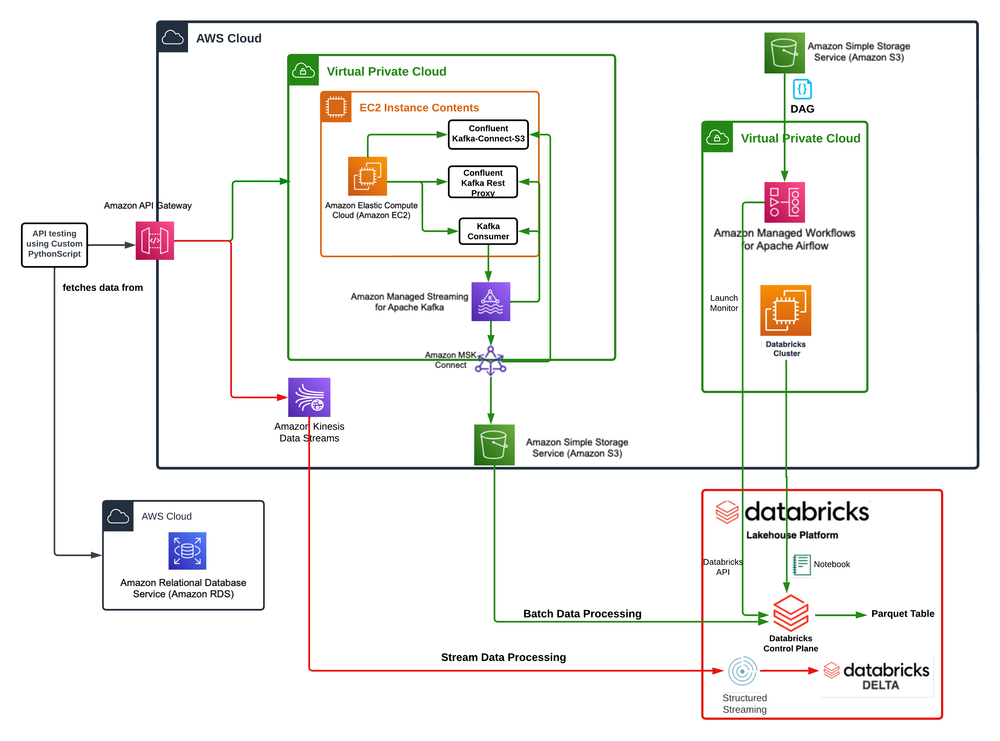

# Pinterest Data Pipeline with AWS MSK Kafka



## Table of Contents
- [Project Overview](#project-overview)
- [Architecture](#architecture)
- [Installation](#installation)
- [Usage](#usage)
- [File Structure](#file-structure)
- [License](#license)
- [Contributing](#contributing)

## Project Overview

The Pinterest Data Pipeline is an end-to-end data streaming pipeline designed to efficiently manage and analyze Pinterest data. The project leverages several AWS services, including:

- **AWS MSK (Kafka)**: For data ingestion from various Pinterest sources.
- **AWS Kinesis**: To perform real-time data streaming and processing.
- **Amazon S3**: For batch and real-time data storage.
- **Databricks**: For data cleaning, transformation, and querying.
- **AWS Managed Workflows for Apache Airflow (MWAA)**: To orchestrate data workflows.

The pipeline processes data such as Pinterest posts, user information, and geolocation data, providing both real-time and batch data processing capabilities. The goal of the project is to demonstrate the use of AWS tools to manage large-scale data streaming and analytics in a distributed environment.

### Key Features:
- **Real-Time Data Streaming**: Using AWS Kinesis to process real-time data.
- **Batch Data Processing**: Using AWS MSK (Kafka) and Databricks to handle batch analytics.
- **Data Storage**: Leveraging Amazon S3 for durable storage of processed data.
- **Workflow Orchestration**: Automating workloads using AWS MWAA.

### What You Will Learn:
- How to set up AWS MSK (Kafka) and manage data streams.
- Using Databricks for data analytics and processing.
- Orchestrating workloads using Apache Airflow on AWS.
- Building and managing real-time and batch data pipelines.

## Architecture

The Pinterest Data Pipeline is built using several AWS services to enable real-time and batch processing of Pinterest data. Below is a summary of the components involved, based on the architecture diagram:

### Key Components:

- **Amazon API Gateway**: Receives data from Pinterest via API testing with custom Python scripts and forwards it to Amazon MSK (Kafka) and Kinesis Data Streams.

- **Amazon Managed Streaming for Apache Kafka (MSK)**: Kafka serves as the core for ingesting Pinterest data, including posts, geolocation, and user information. Data is streamed to Amazon S3 using **Amazon MSK Connect**.

- **Amazon Elastic Compute Cloud (EC2)**: EC2 instances run the necessary Kafka components, such as the **Kafka Connect for S3**, **Kafka REST Proxy**, and **Kafka Consumer** to process the data. The EC2 instances interact with MSK to manage data ingestion.

- **Amazon Simple Storage Service (S3)**: S3 is used to store both batch data ingested from Kafka topics and the results of batch processing from Databricks. S3 acts as the intermediate storage solution for durable data storage.

- **AWS Kinesis Data Streams**: Kinesis is used to create data streams for real-time data ingestion. It works alongside Kafka to provide real-time streaming capabilities for Pinterest data.

- **AWS Managed Workflows for Apache Airflow (MWAA)**: MWAA is used to orchestrate the data processing workflows. Airflow DAGs are defined to launch Databricks jobs, which handle both batch and streaming data processing.

- **Databricks Lakehouse Platform**: Databricks is used to perform data transformation, cleaning, and querying for batch and streaming data. Batch data is read from S3, while streaming data is ingested from Kinesis. The processed data is stored in **Delta Tables** using structured streaming.

### Flow of Data:
1. **Data Ingestion**: Pinterest data is ingested via an API and routed through Amazon API Gateway to Amazon MSK and Kinesis Data Streams.
2. **Batch Storage**: Kafka streams the batch data into Amazon S3 using Kafka Connect.
3. **Data Processing**:
   - **Batch Processing**: Orchestrated via AWS MWAA, Databricks reads batch data from S3, cleans, and processes it, then writes results back to S3.
   - **Stream Processing**: Data from Kinesis is processed in Databricks using structured streaming and saved into Delta Tables.
4. **Workflow Automation**: MWAA triggers Databricks jobs to automate both batch and streaming processes, ensuring seamless and scheduled processing.

## Installation

To set up the Pinterest Data Pipeline, follow these steps:

1. **AWS Account Setup**: Make sure you have access to an AWS account with the necessary permissions to manage MSK clusters, Kinesis streams, S3 buckets, IAM roles, and MWAA environments.

2. **Kafka Setup on EC2**:
   - Connect to your EC2 instance and install Kafka version `2.12-2.8.1`.
   - Install the IAM MSK authentication package to authenticate to the MSK cluster.
   - Update the trust relationship of your IAM role (`<your_UserId>-ec2-access-role`) for MSK authentication.
   - Modify the Kafka `client.properties` file for IAM authentication.

3. **Create Kafka Topics**:
   - Create Kafka topics: `<your_UserId>.pin`, `<your_UserId>.geo`, and `<your_UserId>.user`.

4. **Amazon S3 and MSK Connect Configuration**:
   - Set up the S3 bucket named `user-<your_UserId>-bucket` for data storage.
   - Install Confluent.io S3 Connector and create an MSK connector to save Kafka topic data to the S3 bucket.

5. **API Integration and Kafka REST Proxy Setup**:
   - Create an API resource for proxy integration.
   - Deploy the API and configure the Kafka REST Proxy to send data to Kafka topics.

6. **Batch Data Processing with Databricks**:
   - Mount the S3 bucket to Databricks.
   - Create DataFrames for Pinterest post, geolocation, and user data.
   - Perform data cleaning and transformation using Spark.

7. **Real-Time Data Streaming with AWS Kinesis**:
   - Create Kinesis data streams and configure API integration for streaming data.
   - Read and transform Kinesis streams in Databricks and store them in Delta Tables.

## Usage

The Pinterest Data Pipeline is used for both real-time and batch processing of Pinterest data, with the following steps:

1. **Data Ingestion**: Use Kafka (MSK) and Kinesis to ingest Pinterest data such as user posts, geolocation, and user information.
2. **Batch Processing**: Use Databricks to clean and process data in batches stored in Amazon S3.
3. **Real-Time Processing**: Use AWS Kinesis and Databricks to process data streams in real time.
4. **Orchestration**: Use AWS MWAA to automate the entire workflow, ensuring seamless data processing.

## File Structure

The repository is organized as follows:

```
📁 pinterest-data-pipeline/
├── 📄 .gitignore                      # Git ignore file
├── 📄 0affd9571f39_dag.py             # DAG for Airflow 
├── 📄 README.md                       # Project documentation
├── 📄 batch_processing.ipynb          # Batch processing notebook 
├── 📄 stream_processing.ipynb         # Stream processing notebook 
├── 📄 user_posting_emulation.py       # API integration for posting data
├── 📄 user_posting_emulation_streaming.py # Script for streaming emulation 
```

## License

This project is licensed under the MIT License. See the [LICENSE](LICENSE) file for details.

## Contributing

We welcome contributions! Please read our [CONTRIBUTING](CONTRIBUTING.md) guide for more information.

Feel free to open issues or submit pull requests to enhance the pipeline or add new features.

---
This README provides a summary of the Pinterest Data Pipeline, including setup and usage instructions, with sections for project overview, installation, and workflow orchestration. Let us know if you have any questions or feedback to improve the pipeline further.
